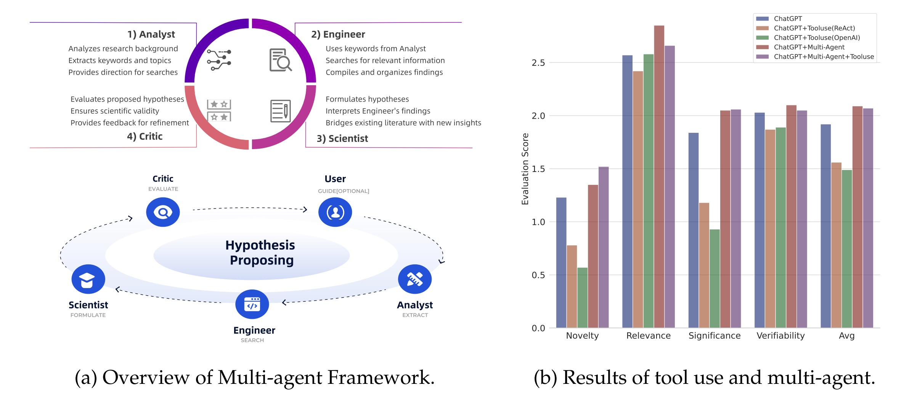

# LLM4BioHypoGen

This repository houses the datasets and code used in our [COLM 2024](https://colmweb.org/) paper: [Large Language Models as Biomedical Hypothesis Generators: A Comprehensive Evaluation](https://arxiv.org/abs/2407.08940).

> An earlier version of this work was accepted at the [NeurIPS 2023 Workshop](https://neurips.cc/virtual/2023/workshop/66498) and is available as a preprint: [Large Language Models are Zero Shot Hypothesis Proposers](https://arxiv.org/abs/2311.05965).

## Data

The dataset includes both "seen" and "unseen" splits, generated by GPT-3.5-turbo and GPT-4. Each subset of the data is organized under the `data` directory as follows:

```bash
- data
  - gpt-3.5
    - test_seen.json
    - test_unseen.json
  - gpt-4
    - test_seen.json
    - test_unseen.json
```

Each element in these files comprises background and hypothesis sentences extracted from the literature using GPT-3.5-turbo or GPT-4.

## Code

The provided code implements our novel multi-agent framework. This framework simulates a collaborative scientific environment, with each agent assigned a specific role. These agents work together in a symbiotic and iterative manner to develop hypotheses that are both innovative and anchored in current scientific understanding. Our approach aims to emulate the dynamics of scientific inquiry, thereby fostering the creation of hypotheses that are scientifically valid and forward-looking. The framework is structured into five key components, including four automated agents and an optional human interaction loop, as shown below:



### Requirements

To install the necessary libraries, run the following command:

```bash
pip install langchain srsly
```

### Running the Code

- To run the multi-agent framework without additional tools, execute:

  ```bash
  cd src
  python run_multi_agent_wo_tool.py
  ```

- To run the multi-agent framework with integrated tools, use:

  ```bash
  cd src
  python run_multi_agent_wo_tool.py
  ```

Ensure that the correct Python file name is used in the second instance if it differs from the first.


## Citation

- COLM 2024 version

```latex
@inproceedings{
  qi2024large,
  title={Large Language Models as Biomedical Hypothesis Generators: A Comprehensive Evaluation},
  author={Biqing Qi and Kaiyan Zhang and Kai Tian and Haoxiang Li and Zhang-Ren Chen and Sihang Zeng and Ermo Hua and Hu Jinfang and Bowen Zhou},
  booktitle={First Conference on Language Modeling},
  year={2024},
  url={https://openreview.net/forum?id=q36rpGlG9X}
}
```

- NeurIPS 2023 Workshop version

```latex
@inproceedings{
qi2023large,
  title={Large Language Models are Zero Shot Hypothesis Proposers},
  author={Biqing Qi and Kaiyan Zhang and Haoxiang Li and Kai Tian and Sihang Zeng and Zhang-Ren Chen and Bowen Zhou},
  booktitle={NeurIPS 2023 Workshop on Instruction Tuning and Instruction Following},
  year={2023},
  url={https://openreview.net/forum?id=EAuteBjTMw}
}
```


